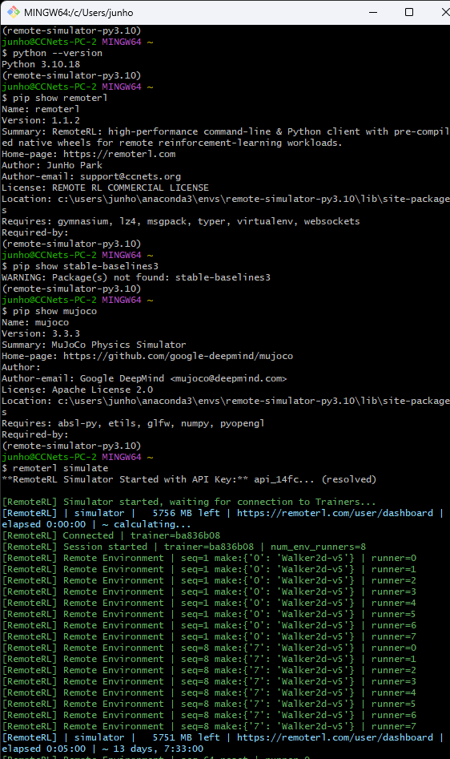
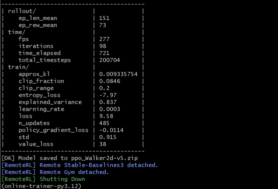

# RemoteRL SDK Console Output Guide (CLI) 💻

> **Purpose**  
> Demonstrate a *fully remote*, CLI-driven **Trainer ↔ Simulator** workflow while highlighting:  
> • **Environment isolation** – distinct conda envs, Python versions, and package sets  
> • The meaning of the **colour-coded** banner lines  

---

## 1  Why show the Python & `pip show` lines?

| Process | Conda env | python version | Key packages present | Key packages **missing** | Take-away |
|---------|-----------|--------------------|----------------------|--------------------------|-----------|
| **Simulator** | `remote-simulator-py3.10` | `Python 3.10.18` | `mujoco-3.3.3`, `remoterl-1.1.2` | **`stable-baselines3`** | Physics engine lives *with* the simulator; learner libs are unnecessary. |
| **Trainer**   | `online-trainer-py3.12`   | `Python 3.12.1`  | `stable-baselines3-2.0.0`, `remoterl-1.1.2` | **`mujoco`** | Uses SB3 but leaves out environment packages (e.g., MuJoCo), proving it learns purely from the streamed data. |

> **Isolation proof**  The Trainer can run on Python 3.12 while the Simulator stays on 3.10, each inside its own conda environment—RemoteRL links them seamlessly over the wire through its cloud relay.

---

## 2  Simulator terminal (`remoterl simulate`)

| Call-out | Meaning |
| --- | --- |
| `python --version` | Simulator is running **Python 3.10**. |
| `pip show remoterl` | **RemoteRL SDK 1.1.2** present. |
| `pip show stable-baselines3` | *Package not found* – learner library not needed here. |
| `pip show mujoco` | **MuJoCo 3.x** (physics engine) installed. |
| `remoterl simulate` | Boots the simulator and connects to RemoteRL Cloud (WSS). |
| **Sky** `simulator │ 5756 MB left │ … │ elapsed 0:00:00` | Live quota / service banners  |
| **Green** `Connected │ trainer=ba836b08` | Secure WebSocket handshake complete; shows trainer ID. |
| **Green** `Remote Gym enabled with 2 workers and 8 runners` | Confirms trainer’s fan-out request took effect. |
| **Green** `Remote Environment …` rows | Lists each Gym API call (`make`, `reset`, `step`, …) as it reaches its matching environment runner on the simulator side occasionally |

---

## 3  Trainer terminal (`remoterl train sb3 --algo PPO`)

| Call-out | Meaning |
| --- | --- |
| `python --version` | Trainer is running **Python 3.12.1** in its own Conda env. |
| `pip show remoterl` | **RemoteRL SDK 1.1.2** present. |
| `pip show stable-baselines3` | **Stable-Baselines3 2.0.0** present (learner library). |
| `pip show mujoco` | *Package not found* – trainer needs no physics engine. |
| `remoterl train …` | Starts the trainer and authenticates to RemoteRL Cloud with your `api_key`. |
| **Sky** `trainer │ 5744 MB left │ … │ elapsed 0:00:00` | Live quota / service banners |
| **Purple** `patch_news` | SDK hot-patch applied live. |
| **Green** `Remote Gym enabled with 2 workers and 8 runners` | Confirms the Remote Gym proxy is live, fanning out 2 workers across 8 environment runners. |
| **Rollout / Train metrics** tables | Periodic SB3 logger dumps (fps, ep_len_mean, losses…). |
| `Model saved to ppo_Walker2d-v5.zip` | Checkpoint written at 200 k timesteps. |
| **Green** detach lines (`Remote Stable-Baselines3 detached`, …) | Indicates a graceful shutdown—every RemoteRL proxy (Gym, SB3, etc.) has detached cleanly. |

---

## 4  Colour Legend 🖋️

* **Green**  Success / healthy status  
* **Sky**   Service / account quota banners  
* **Purple** Hot-patch messages (proxy attach / detach to Gym & SB3)  
* **Red**   Error / failure (none in a clean run)

## 5  Handy CLI Flags(`after SDK (Python) 1.1.4`)

* **Need monochrome logs?** `export REMOTERL_NO_COLOR=1` before launching.  
* **Banner too chatty?** `export REMOTERL_NO_BANNER=1` to suppress the live credit/FPS banner.

> **Last updated:** 2025‑07‑08
